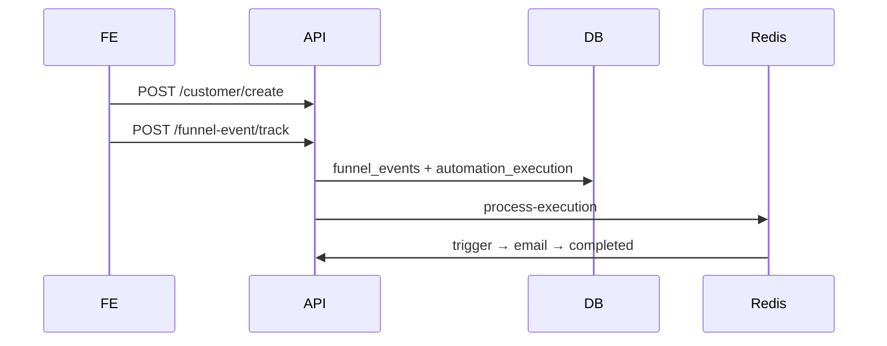

# Automation & funnel signup

How automations run in the backend, including **welcome email on funnel registration**.

---

## Overview

An **automation** = nodes + connections on a funnel/campaign. A **run** = one `automation_execution` row + logs. Work runs in the background via **Redis (BullMQ queue `automation`)**.

**Two execution paths:**

| Path | When | Queue job | Who |
|------|------|-----------|-----|
| **Event-driven** | Funnel track (signup/payment) or admin re-process | `process-execution` | One customer, step-by-step |
| **Manual batch** | Admin “Run” on payment-reminder automation | `unpaid-reminder-batch` | All unpaid signups on funnel |

---

## Funnel signup (registration)

### Frontend (do this only)

1. `POST /customer/create`
2. `POST /funnel-event/track` — signup or payment (do **not** call `/automation/.../execute` for these)

```json
{ "eventType": "signup", "funnelId": 1, "customerId": 42 }
```

Public endpoint: `POST /funnel-event/track` → saves `funnel_events` → `handleEvent()`.

### What happens next

1. Find active automations: `trigger = signup`, scope matches funnel/campaign/restaurant, no active run for same customer.
2. Create `automation_execution` (start at trigger node).
3. Enqueue `process-execution` → worker runs **trigger** then **email** (if connected).
4. No next node → status `completed`.



### Welcome email setup

| Requirement | Detail |
|-------------|--------|
| Purpose | `funnel_signup` (auto on track) |
| Flow | `Trigger → Email` (wired in builder) |
| Email node | `config.subject` required; customer must have email |
| Infra | Redis + mail env |
| Scope | Automation `funnelId` / `campaignId` must match event |

**Note:** `handleEvent` only auto-starts `funnel_signup` on signup track (not payment-reminder). Duplicate welcome runs are blocked (active or completed execution for same automation + customer). Automations only fire on **new** funnel event rows, not signup updates.

---

## Purposes

| Purpose | Trigger | Runs via |
|---------|---------|----------|
| `funnel_signup` | signup | Auto track |
| `funnel_signup_payment_reminder` | signup | Manual execute only |
| `funnel_payment` | payment | Auto track on paid payment (`POST /funnel-event/track` payment) |
| `funnel_abandoned_checkout_reminder` | varies | Builder/event |

---

## Event-driven path (Path A)

**Start:** `track()` → `handleEvent()` or `POST /automation/execution/:id/process`

1. `createExecution` at trigger (or first node by order)
2. Each job: `processExecution` → run node → advance or complete
3. **Next node:** connection `source → target`, else next higher `node_order` (never back to trigger)
4. **Wait node:** status `waiting` + delayed `resume-execution`

**Nodes:** `trigger` (log), `email` (send), `wait`, `condition` (may stop flow), `sms`/`whatsapp`/`coupon`/`tag` (log + advance)

**Statuses:** `queued` | `running` | `waiting` | `completed` | `failed`

---

## Manual batch path (Path B)

**Start:** `POST /automation/execution` or `POST /automation/:id/execute` (only `funnel_signup_payment_reminder`)

1. Build plan from `node_order` (email + unpaid condition)
2. Load unpaid customers for funnel
3. One job emails all recipients; updates `emailsSentCount`

---

## Queue

| Job | Handler |
|-----|---------|
| `process-execution` | `AutomationEngineService.processExecution` |
| `resume-execution` | `AutomationEngineService.resumeAfterWait` |
| `unpaid-reminder-batch` | `AutomationService.runUnpaidReminderBatch` |

Env: `REDIS_HOST`, `REDIS_PORT`. Concurrency: 2. Retries: 3× exponential backoff.

---

## Key APIs

| Method | Path | Notes |
|--------|------|-------|
| `POST` | `/funnel-event/track` | Public — signup/payment |
| `POST` | `/automation/:id/execute` | Batch unpaid reminders |
| `GET` | `/automation/execution/:id/status` | Poll until terminal |
| `GET` | `/automation/execution/:id/logs` | Step log |
| `GET` | `/automation/execution` | List runs (paginated) |
| `GET` | `/automation/node/funnel/:funnelId` | Builder graph |

Full CRUD: `/automation`, `/automation/node`, `/automation/connection` (JWT admin).

---

## Tables

`automation` · `automation_node` · `automation_connection` · `automation_execution` · `automation_log` · `funnel_events` · `customers`

---

## Quick reference

| Goal | Action |
|------|--------|
| Welcome on register | Active `funnel_signup` + track signup |
| Payment thank-you | Active `funnel_payment` + track payment (paid) |
| Remind unpaid signups | `POST /automation/:id/execute` |
| Debug a run | `GET .../execution/:id/logs` |
| Stuck / log spam | Fix flow (no cycles); clear Redis `automation` queue |

---

## Code locations

| Area | Path |
|------|------|
| Track | `src/modules/funnel-event/funnel-event.service.ts` |
| Events → runs | `src/modules/automation/automation.service.ts` |
| Step engine | `src/modules/automation/automation-engine.service.ts` |
| Queue worker | `src/modules/automation/automation-queue.processor.ts` |
| Templates | `src/templates/automation/registry.ts` |
